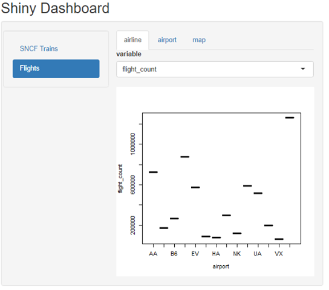

```{r setup, include=FALSE}
knitr::opts_chunk$set(echo = FALSE)
```
## Project presentation

The main goal of this R project is to study and create a dashboard from 2 datasets. The final achivement is to be able to explore these both dataset throught a dashboard.

<div class="red2">
 Summary :
</div>

  1. The first dataset : **SNCF trains**
  2. The second one : **2015 US flights**
- github link:
 https://github.com/natna25/R-Shiny-Application

- rpubs link:
 http://rpubs.com/antoineth/561272

-shiny app link:
 https://antoinethery.shinyapps.io/shiny_dashboard/

## SNCF | Discovering the dataset

The SNCF dataset containing various information about trains. Our main goal is to provide a visualisation along years and stations throught the dashboard. 

```{r, include=FALSE}
library(dplyr)
library(readr)
library(rmarkdown)
library(knitr)

data_dir = "data/raw/"
trains = read.csv( "data/raw/french-sncf-trains-regularities/full_trains.csv" )
delays = read_csv2("data/raw/french-sncf-trains-regularities/regularite-mensuelle-tgv-aqst.csv")
```
```{r}
kable(trains[1:4,1:6])

```

## SNCF | Preprocess, aggregation by date
Let's determine the average departure delay time of delayed trains
```{r, echo=FALSE}
trains = data.frame(trains)
delays = data.frame(delays)
train_agg = data.frame()

#8
avg_depart_delay = aggregate(avg_delay_late_on_arrival ~ year, trains, mean)

```
```{r}
plot(factor(avg_depart_delay$year), avg_depart_delay$avg_delay_late_on_arrival)
```

## 2015 US flights | Discovering the dataset

The 2015 US flights dataset. For this one, our goal is to provide a visualisation of data according the different airline and airport. 

```{r, include=FALSE}

flights = read_csv("data/raw/flights.csv")
airlines = read_csv("data/raw/airlines.csv")
airports = read_csv("data/raw/airports.csv")
```
```{r}
kable(flights[1:4,1:6])
```

## 2015 US flights

Related dataset for more information :
```{r, echo=FALSE}
kable(airlines[1,])
kable(airports[1:2,])
```


## 2015 US flights | Preprocess, aggregation by date
Let's determine the average flight distance
```{r, echo=FALSE}
avg_flight_distance = flights %>% group_by(AIRLINE) %>% summarise(distance = mean(DISTANCE, na.rm=TRUE))
plot(factor(avg_flight_distance$AIRLINE),avg_flight_distance$distance)
```


## Visualisation throught a dashboard
Here is the dashboard we have created thanks the different data pre-processed.
The main goal of our dashboard is to provide a clear view of both dataset thanks tab panel and linked tabs.



